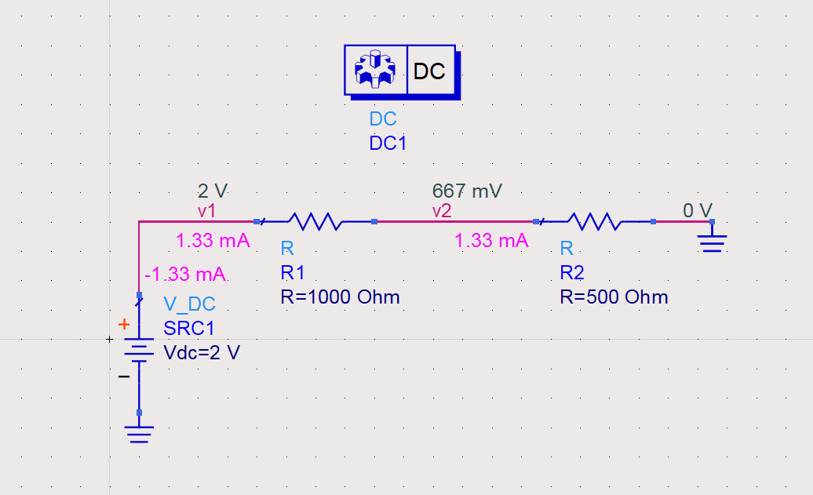
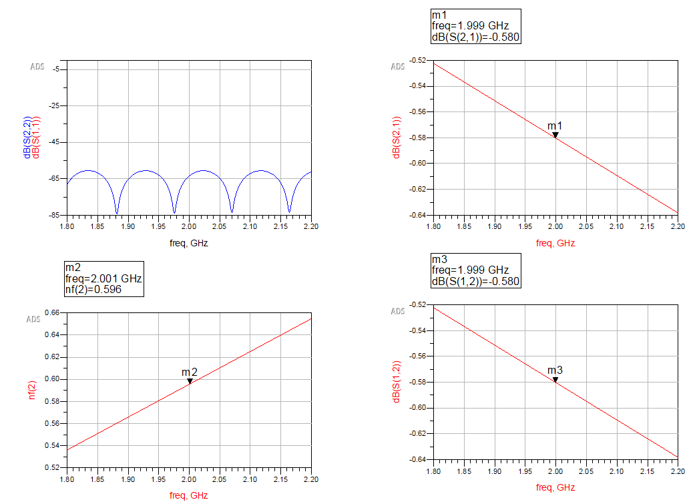
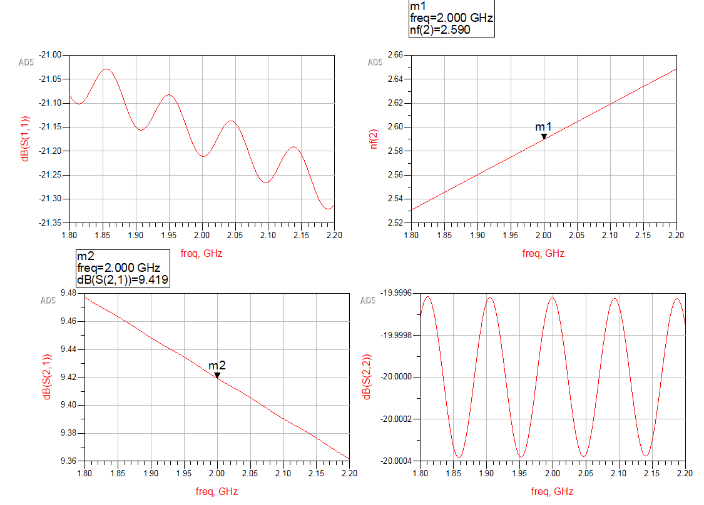

# ADS RF Design and Analysis Series

## Project Overview
This series comprises detailed RF design and analysis tasks performed using the Advanced Design System (ADS) software. Each task is crafted to help students and professionals alike understand the intricacies of RF circuit behavior, simulation techniques, and their applications in real-world scenarios.

## Simulation Tasks
### Task 1: DC Simulation of a Resistive Voltage Divider
- **Objective**: Understand the basic DC behavior and voltage division in a resistive circuit.
- **Key Learning**: Voltage distribution across resistors and the impact of different resistances.
<p float="left">
  
   
</p>

### Task 2: S-Parameter Simulation of Gain Stages
- **Objective**: Explore the transmission and reflection characteristics of RF amplifiers.
- **Key Learning**: Analysis of S-parameters to gauge amplifier performance and network behavior.
<p float="left">
  
</p>

### Task 3: Cascaded Gain and Noise Figure Computation
- **Objective**: Evaluate the combined effect of cascading multiple RF stages on gain and noise.
- **Key Learning**: Computation and interpretation of cascaded gain and noise figures.
<p float="left">
  
  
</p>

### Task 4: Transmission Line Simulation
- **Objective**: Analyze how transmission lines affect RF signals over distance and different materials.
- **Key Learning**: Impedance matching, signal integrity, and loss considerations.
<p float="left">
  
  
</p>

### Task 5: Cascaded Gain Stage and Transmission Line Analysis
- **Objective**: Combine gain stages and transmission lines to study complex RF systems.
- **Key Learning**: Overall system performance including gain and noise figure over cascaded components.
<p float="left">
  
  
</p>

<p float="left">
  
  
</p>

## Installation and Setup
To run these simulations, ensure you have access to ADS with a valid student or educational license. Follow the steps below to get started:
1. Obtain an ADS license [here](https://connectlp.keysight.com/StudentLicense) if you haven't already.
2. Install ADS on your machine as per the installation guide provided with the software.
3. Clone this repository to access the simulation files:
   ```bash
   git clone https://github.com/Mrudhulesh/RF-Simulations.git

4. Open the respective project files in ADS from the cloned repository.
## Usage
Navigate to the specific task directory within the cloned repository:

- Load the provided schematic in ADS.
- Follow the simulation setup instructions detailed for each task to run the simulations.
- Review the simulation results within ADS to understand the RF design behaviors and principles discussed.
## Contributing
Contributions to improve or enhance the simulations are highly encouraged. Please fork the repository, commit your enhancements, and submit a pull request for review.

## License
This project is licensed under the MIT License - see the [LICENSE.md](LICENSE.md) file for details.
